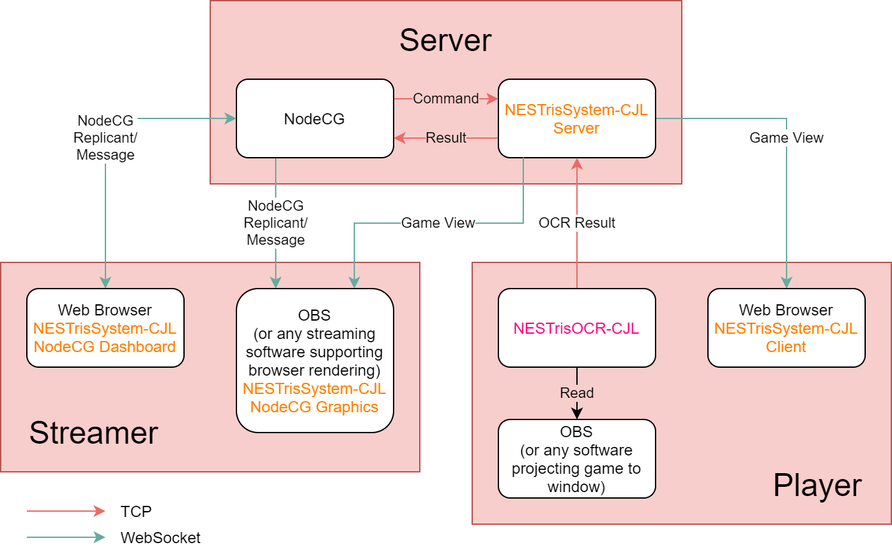

# NESTrisSystem-CJL

Servers and a NodeCG bundle used for running [CTWC Japan Lite](https://sites.google.com/view/classic-tetris-japan/).

## Overview



NESTrisSystem-CJL consists of 3 parts:

* *Server*: Receives each player's *OCR Result* and sends *Game View* to *Client* and *NodeCG Graphics*.
  * *Server Test Client*: Connects to *Server* and sends random data. For debugging without NESTrisOCR-CJL.
* *Client*: A webapp which receives and renders all connected players' *Game View*
* *NodeCG Bundle*: Everything needed to generate and control streamer screen. For more information, see [NodeCG documentation](https://nodecg.com/docs/concepts-and-terminology).
  * *NodeCG Graphics*: The screen broadcast.
  * *NodeCG Dashboard*: Controls *Graphics* and *Server*.
  * *NodeCG Extension*: Where communication with *Server* is done actually.

Server and Streamer softwares can be run on the same machine.
For NESTrisOCR-CJL, see [NESTetrisJP/NESTrisOCR-CJL](https://github.com/NESTetrisJP/NESTrisOCR-CJL).

## Contents

* `dist-client/`: *Client* built.
  * `icons/`: See [Icons](#icons).
* `dist-nodecg/`: *NodeCG Bundle* built.
  * `ctwc-japan-lite/package.json`: *NodeCG Bundle* configurations.
* `dist-server/`: *Server* and *Server Test Client* built.
* `doc/`: Documentation.
* `src/`: Source files.
  * `client/`: *Client* source files.
  * `common/`: Source files common to *Client*, *Server*, and *NodeCG Bundle*.
  * `nodecg/`: *NodeCG Bundle* source files.
    * `common/`: Source files common to *NodeCG Graphics* and *NodeCG Dashboard*.
    * `dashboard/`: *NodeCG Dashboard* source files.
    * `extension/`: *NodeCG Extension* source files.
    * `graphics/`: *NodeCG Graphics* source files.
  * `server/`: *Server* and *Server Test Client* source files.
* `types/`: TypeScript type definitions.

## Setup

1. [Install Node.js](https://nodejs.org/).
2. Clone this repository.
3. Run `npm install` in this project's root directory.
4. [Install NodeCG](https://nodecg.com/docs/installing).
5. Configure NodeCG. Create `cfg/nodecg.json` in NodeCG installation directory and append:
```json
{
  "bundles": {
    "paths": [
      "[NESTrisSystem root directory]/dist-nodecg"
    ]
  }
}
```
**Note**: You should also enable login feature if you run NodeCG remotely. See [NodeCG documentation](https://nodecg.com/docs/security).

6. Configure server. Create `loginlist.json` in NESTrisSystem root and append:
```json
[
  {"userName": "[User name set to OCR and displayed to Game View]", "key": "[Access key set to OCR]"}
  ...
]
```

## Running

1. Run `npm run build:all` in NESTrisSystem root to build everything.
2. Run `npm run run:server` in NESTrisSystem root to run *Server*.
3. Run `npm run run:client -p 80` in NESTrisSystem root to run *Client*.
4. Run `nodecg start` in NodeCG root to run *NodeCG*.

**Note**: When running *Client*, you may need `sudo` to open port 80.

## Developing

1. Run `npm run dev:all` in NESTris System root to watch source files and rebuild if any of the source files is changed. This also launches a web server at port 1234 hosting *Client*.
2. To debug *Client*, simply access http://localhost:1234/ .
3. To debug *Server*, run `npm run run:server --debug` in NESTrisSystem root. The `--debug` option disables `loginlist.json` and allows arbitrary user to connect to the *Server*.
4. (Optional) To use *Server Test Client* instead of connecting from NESTrisOCR-CJL, run `npm run: run:server:testClient` in NESTrisSystem root.
5. To debug *NodeCG Bundle*, run `nodecg start` in NodeCG root.

**Note**: If you changed the source files of *Server*, *Server Test Client*, or *NodeCG extension*, you must restart them manually.

## Icons

Put square PNG files to `dist-client/icons/[MD5 hash of user name].png` to show user icons in *Client* and *NodeCG Graphics*.

## Running in HTTPS mode

You will need SSL Certificate file (.pem) and SSL Certificate Key file (.pem).

1. Set environment variable `SSL_CERT=[Certificate file]`
2. Set environment variable `SSL_KEY=[Certificate Key file]`
3. Configure NodeCG. Append the following to `cfg/nodecg.json` in NodeCG root:
```json
{
  "ssl": {
      "enabled": true,
      "keyPath": "[Certificate Key File]",
      "certificatePath": "[Certificate File]"
  }
}
```
4. For running *Server*, run `npm run run:server --ssl`
5. For running *Client*, run `npm run run:client -p 443 -S -C $SSL_CERT -K $SSL_KEY`
6. For running *NodeCG*, run `nodecg start` with modified config.

**Note**: You may need `sudo -E` to run the program as a superuser while preserving environment variables.

## License

MIT. See [LICENSE](LICENSE).